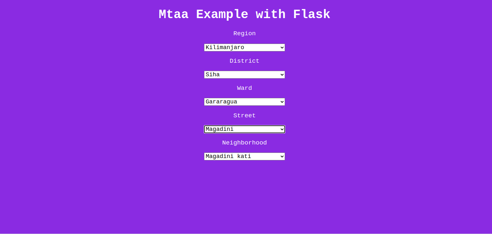

# mtaa-example-with-flask

A minimal flask application showing you how you can use mtaa in your web application.

</img>

It uses JQuery to send requests to fetch locations from flask routes without refreshing the page

## Getting started

You need to clone the repository or download manually

```bash
git clone https://github.com/Kalebu/mtaa-example-with-flask
cd mtaa-example-with-flask
mtaa-example-with-flask -> python app.py
```

Assuming you already have installed flask on your machine, the app should be running at localhost:5000

## Issues

Facing any issue while running it, raise one and looking forward to fixing it as soon as I can

## Contribute ?

Wanna add something whether a typo, docs or code, just fork it 

## Credits

All the Credits to [kalebu](https://github.com/Kalebu)